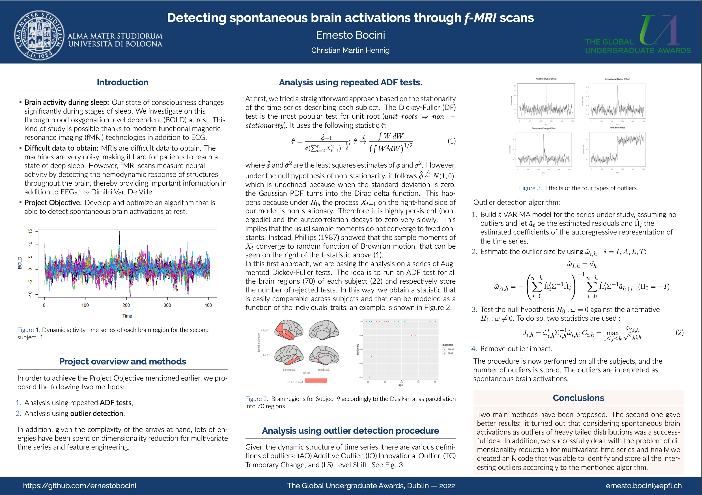

# Brain_Activation_At_Sleep
Developed an algorithm for ddetecting spontaneous Brain Activations for subjects at rest through series of fMRI scans

## General Information

The repository contains the code for the Final thesis Project of my Bachelor studies: University of Bologna, curriculum STATS & MATHS. The project is realized with the help and supervision of Prof. Christian Martin Hennig. Data and further suggestions were provided by Prof. Alessandra Luati.

### Data
The Project is based on two fundamental datasets: `fMRI-ROI-time-series` and `SUBJ-covariates`. They are located inside the "data" folder, together with additional datasets which are created by running the code in "scripts" folder following the suggested order.

### Environment
The project has been developed and test with `R 4.2.1`.
The required libraries for running the models and training are can be found inside the folder "install_libraries".

### Results

The award-winning algorithm can be found in the r-code file number 5 inside "scripts" folder. In order to be able to run the script, all the r files must be runned in the suggested order. 
Results as shown in the "report" paper and the "presentation" powerpoint can be obtained applying the algorithm to each subject separately.

## Repository structure

In order to be able to explore the folders, simply click on `Brain_Activation_At_Sleep.Rproj`, this will bring you directly on R with the right working directory. 

### data

The Project is based on two fundamental datasets: `fMRI-ROI-time-series` and `SUBJ-covariates`. They are located inside the "data" folder, together with additional datasets which are created by running the code in "scripts" folder following the suggested order.

### images

Folder with the images that are used inside the "report", created using R plot and specific visualization libraries.

### latex_elements

Tables for latex usage. Obtained directly converting r-arrays and tibbles using `xtable` package.

### References

Folder containing all the consulted papers and publications. 

### Scripts

Main folder of the project, containing all the Rcodes. 

### Report

My thesis paper, giving a detailed walthrough of the process that lead me and my Professor finding the final optimal algorithm.
Several objectives were set to enable this project to achieve its aim. 

The initial objective relates to the preparation of the data so that it can be used to proceed with more advanced analysis. This will ensure a correct scanning of missing quantities and an understanding of which data sets we really want to analyze. In the case of this project, this means ensuring that the missing values can be removed without major hazards and that we have a clean mapping between the BOLD time series and the subjects traits. This is vitally important; otherwise the analysis couldn't proceed. 

The second objective will be to define a statistic that is able to capture differences among subjects based on their BOLD time series, and that can be somehow explained by the subjects' traits. In this project, we will first try a straightforward approach based on the stationarity of the time series describing each subject. Then we will focus on outlier detection. The first step to achieve this will be to research and choose the outlier detection algorithm that most suits our data. Then we translate the algorithm into the software language, and we check whether it produces an effective distinction among subjects.

The just mentioned outlier detection procedure introduces two further objectives. Dimensionality reduction for multivariate time series and identification + fitting of a multivariate time series. 

### Global-Undergraduate-Awards

Folder containing information on the award. Among 2,812 entries, my project has been recognised as being the best performing in the Computer Science category in Europe, and generally in the global 10% of the same category.

